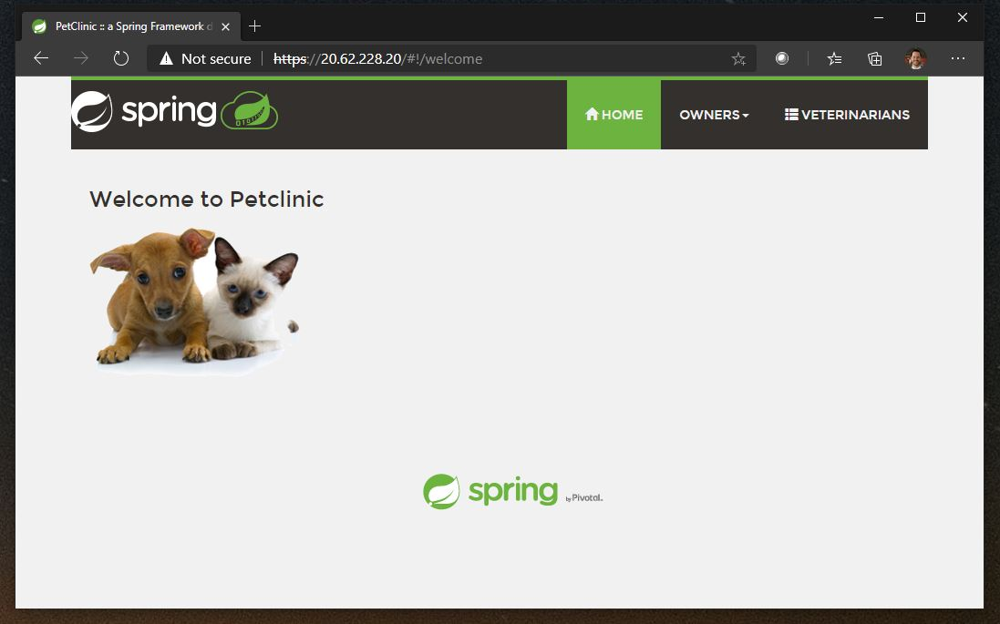

# Azure CLI Quickstart - Azure Spring Cloud Reference Architecture

## Overview

## Prerequisites

1. [Install Azure CLI](https://docs.microsoft.com/en-us/cli/azure/install-azure-cli)

2. Run the two commands below to add the required extensions to Azure CLI if they are not installed already

    `az extension add --name azure-firewall`

    `az extension add --name spring-cloud`

3. The script has been tested using `Azure CLI version 2.17.1`

## Deployment


1. Run `az login` to log into Azure

2. Run `az account set --subscription {your subscription name}` to set your default subscription

3. Execute the `deploy-azurespringcloud-internal.sh` Bash script.  You will be prompted at the start of the script to enter:

    - User Principal Name for [Azure Key Vault access policies](https://docs.microsoft.com/en-us/azure/key-vault/general/secure-your-key-vault)
    
    - [Azure Virtual Machine](https://azure.microsoft.com/en-us/services/virtual-machines/) administrator name and password
        - [Password syntax](https://docs.microsoft.com/en-us/azure/virtual-machines/windows/faq#what-are-the-password-requirements-when-creating-a-vm)
        - [Administrator syntax](https://docs.microsoft.com/en-us/azure/virtual-machines/windows/faq#what-are-the-username-requirements-when-creating-a-vm)

    - [Azure database for MySQL](https://azure.microsoft.com/en-us/services/mysql/) administrator and password
        - [Password syntax](https://docs.microsoft.com/en-us/azure/mysql/quickstart-create-mysql-server-database-using-azure-cli#create-an-azure-database-for-mysql-server)
        - [Administrator syntax](https://docs.microsoft.com/en-us/azure/mysql/quickstart-create-mysql-server-database-using-azure-cli#create-an-azure-database-for-mysql-server)

    - A valid Azure Region where resources are deployed
        - Run `az account list-locations -o table --query "[].name"` command to find list of available regions.

**Note:** Due to a known caching issue in East US 2 region, default routes need to be added to Azure Spring Cloud route tables manually.  Azure Spring Cloud apps and service runtime resource groups contain a single route table where a 0.0.0.0/0 route with Next Hop Address of Azure Firewall private IP address is needed.

## Post Deployment

Install one of the following sample applications:
* [Simple Hello World](https://docs.microsoft.com/en-us/azure/spring-cloud/spring-cloud-quickstart?tabs=Azure-CLI&pivots=programming-language-java)
* [Pet Clinic App with MySQL Integration](https://github.com/azure-samples/spring-petclinic-microservices)

## Deploy Azure Application Gateway with WAF (optional)

1. You will need a TLS/SSL Certificate with the Private Key (PFX Format) for the Application Gateway Listener. The PFX certificate on the listener needs the entire certificate chain and the password must be 4 to 12 characters. For the purpose of this quick start, you can use a self signed certificate or one issued from an internal Certificate Authority. You will need to convert the certificate to a Base64 string value for the next step. The following will set the Base64 string value to a variable to be used as part of the deployment (replace the file name with your own).

    `export HTTPSDATA=$(base64 -w 0 nameofcertificatefile.pfx)`

2. Execute the template and when prompted, enter the certificate password for https_password and the FQDN of the internal Azure Spring Cloud application e.g. petclinic-in-vnet-api-gateway.private.azuremicroservices.io. Note: For this quickstart, use the same resource group that was created previously.

    `az deployment group create --resource-group my-resource-group --name appGW --template-uri="https://raw.githubusercontent.com/Azure/azure-spring-cloud-reference-architecture/main/ARM/resources/deployAppGw.json" --parameters https_data=${HTTPSDATA}`

3. Once deployed, look for the Application Gateway Resource in the Resource Group and note the Frontend Public IP address

4. From a browser that isn't in the quick start virtual network, browse to https://<publicIPofAppGW>. You will get a warning in the browser that the connection is not secure. This is expected as we are connecting via the IP address. Proceed to the page anyway.




## Additional Notes

This quick start deploys an Azure Application gateway with a basic listener. To host multiple sites on the same Application gateway, you can use multi-site listeners. For more information see https://docs.microsoft.com/en-us/azure/application-gateway/multiple-site-overview

Azure Application Gateway can also retrieve TLS certificates from Azure Key Vault. Fore more information see https://docs.microsoft.com/en-us/azure/application-gateway/key-vault-certs 

## Cleaning up

Unless you plan to perform additional tasks with the Azure resources from the quickstart (such 
as post deployment steps above), it is important to destroy the resources that you created 
to avoid the cost of keeping them provisioned.

The easiest way to do this is to call `az group delete`.

```azurecli
az group delete --name sc-corp-rg --yes --no-wait
```