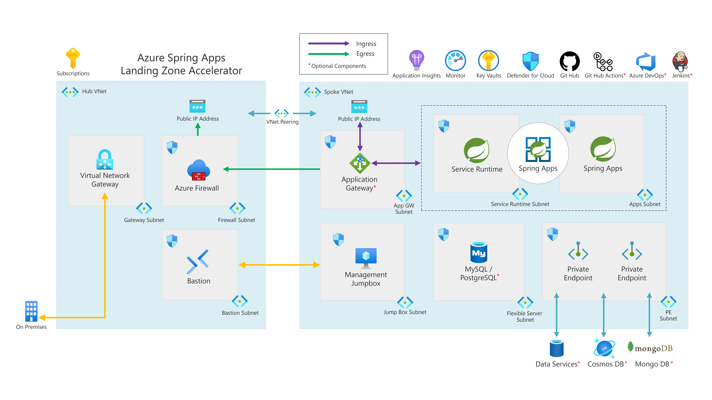

# Azure Spring Apps Secure Baseline with VNet Injection

This reference implementation can be used for experimenting with Spring Boot applications in a typical enterprise landing zone design for a regulated organization. It uses a hub and spoke architecture with a single spoke. East/West traffic (traffic between resources in the hub and resources in the spoke) is filtered with Network Security Groups and an Azure Firewall is used for controlling outbound traffic to the internet. An Azure Application Gateway with Web Application Firewall is used to protect inbound HTTP/s connections to Azure Spring Apps from the internet.   

Additional features of this quickstart are:

* Azure Spring Apps (Standard or Enterprise) is deployed using [vnet-injection](https://learn.microsoft.com/en-us/azure/spring-apps/how-to-deploy-in-azure-virtual-network) 
to allow for mediation inbound and outbound traffic to the Azure Spring Apps Instance and deployed applications.
* The Azure Firewall instance has been configured to write its logs to a Log Analytics Workspace. 
You can leverage [these Kusto queries](https://learn.microsoft.com/en-us/azure/firewall/firewall-workbook) 
to analyze Azure Firewall log data written to Log Analytics.
* Azure Private DNS zones for Azure Spring Apps and support services deployed with Private Endpoints
* A single Windows Server 2022 Virtual Machine deployed into the spoke Virtual Network for testing access to 
applications deployed into the Azure Spring Apps instance. This VM is 
not exposed to the internet and is only accessible via Azure Bastion.
* Log Analytics Workspace where Azure Spring Apps and Azure Firewall deliver 
logs and metrics.
* Application Insights for monitoring applications deployed to Azure Spring Apps.
* Instance of Azure Key Vault deployed with a Private Endpoint for secrets and certificates storage 
for applications deployed to Azure Spring Apps.
* Instance of Azure Bastion for connection to the Windows Server 2022 virtual machine running in the virtual network.

## Core architecture components

* Azure Spring Apps Standard/Enterprise with VNet Injection
* Azure Virtual Networks (hub-spoke)
* Azure Bastion
* Azure Firewall
* Azure Application Gateway with WAF (optional)
* Azure Key vault
* Azure Private DNS Zones
* Log Analytics Workspace
* Application Insights

## Next
Pick one of the IaC options below and follow the instructions to deploy the Azure Spring Apps reference implementation.

:arrow_forward: [Terraform](./Terraform)
:arrow_forward: [Bicep](./Bicep)
