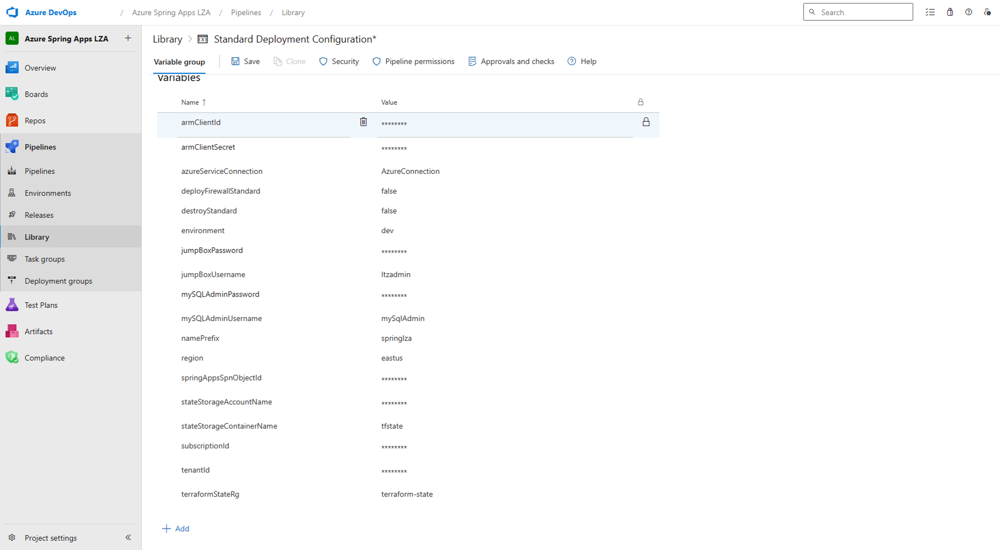
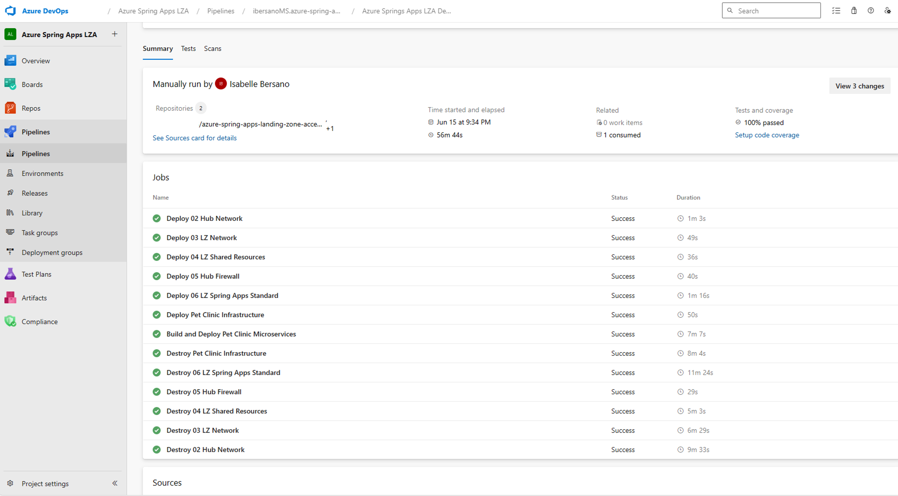

# Deploying the Landing Zones and Pet-Clinic microservices E2E using Azure DevOps

 To deploy the Azure Spring App Landing Zone Accelerator and deploy the petclinic microservices to Azure Spring Apps, we'll setup an Azure DevOps CI/CD pipeline that will build and deploy our application whenever we push new commits to the main branch of our repository.

## What's CI/CD?

CI/CD stands for _Continuous Integration_ and _Continuous Delivery_.

Continuous Integration is a software development practice that requires developers to integrate code into a shared repository several times a day.
Each integration can then be verified by an automated build and automated tests.
By doing so, you can detect errors quickly, and locate them more easily.

Continuous Delivery pushes this practice further, by preparing for a release to production after each successful build.
By doing so, you can get working software into the hands of users faster.

## What's Azure DevOps?

[Azure DevOps](https://azure.microsoft.com/en-us/products/devops/)

## Setting Up Azure DevOps for deployment

To set up your Azure Pipeline for deployment, you'll first need an Azure DevOps project to handle hold the variable group, pipeline and GitHub repository integration. We then need to setup an Azure Service Connection for deployment of resources, a variable group and integrate the Azure DevOps pipeline that we've created for you. 

## Setup secrets and variables

Secrets and variables in AzureDevOps are stored in variable groups. Both are referenced the same way in the pipeline, $(variableName). You have the option of integrating secrets from an Azure KeyVault into your variable group, but for the purposes of this deployment, we will be using the secret capability in the variable group.  

In Azure DevOps, secrets and variables are defined at the project level. 
To create your variable group, go to the Library tab of your project under the Pipelines section, and select + Variable Group, in the top menu. The variable group must have the name, Standard Deployment Configuration, or you will need to edit the workflow with the name you used so it correctly picks up your variables. 

## Create variables and secrets for this workflow

| Secret Name                  | Value                                                                                              |Default   |
| -----------------------------|----------------------------------------------------------------------------------------------------|----------|
| `armClientId`                | The client ID of the Azure SPN you're using for deployment                                         | Required |
| `armClientSecret`            | The client secret of the Azure SPN you're using for deployment                                     | Required |
| `azureServiceConnection`     | Name of the Azure Service Connection you configured with your Azure credentials                    | Required |
| `deployFirewallStandard`     | Optional                                                                                           | false    |
| `destroyStandard`            | Optional                                                                                           | false    |
| `environment`                | Optional                                                                                           | dev      |
| `jumpBoxUsername`            | Optional                                                                                           | ltzadmin |
| `jumpBoxPassword`            | Password for the jump box to access resources                                                      | Required |
| `region`                     | Optional                                                                                           | eastus   |
| `springAppsSpnObjectId`      | The object ID of your subscription's Spring Apps SPN. See [below]() for how to retrieve this value.| Required |
| `stateStorageAccountName`    | Name of Azure Storage Account for storing your Terraform State                                     | Required |
| `stateStorageContainerName`  | Name of the Azure Storage Blob Container for storing your Terraform State                          | Required |
| `subscriptionId`             | Your Azure subscription ID                                                                         | Required |
| `tenantId`                   | Your Active Directory Tenant ID                                                                    | Required |
| `terraformStateRg`           | The Azure Resource Group where your State Storage Account lives                                    | Required |

The variable group should look like the following:


## Find the Object ID for Spring Apps Service Principal
* Retrieve the `SPRINGAPPS_SPN_OBJECT_ID` with the value of the the Object ID for the "Azure Spring Apps Resource Provider" service principal in your Azure AD Tenant.
  
You use the command below to obtain the value of the variable:

      az ad sp show --id e8de9221-a19c-4c81-b814-fd37c6caf9d2 --query id --output tsv


## Where to find the workflow `deploy_standard.yml`
The workflow file can be found in your repository with the path [`.github/workflows/deploy_standard.yml`](../../../.ado/deploy_standard.yml) :

This workflow will be triggered every time a commit is pushed to the `main` branch.
It will then run a job with the following steps:

* Deploy 02 Hub Network
* Deploy 03 LZ Network
* Deploy 04 LZ Shared Resources
* Deploy 05 Hub Firewall
* Deploy 06 LZ Spring Apps Standard
* Deploy Pet Clinic Infrastructure

After the above steps are successful, you will have a functioning landing zone and the Azure Spring App instance available. After the above, the pipeline also runs the below build step to build and deploy the petclinic microservices in the Azure Spring Apps instance.

* Build and Deploy Pet Clinic Microservices

Make sure to keep the correct indentation for the steps if you make changes to the deploy.yaml file directly.
YAML is very sensitive to indentation.

## [!TIP]

* If you do not want to provision the firewall or destroy the E2E infra once the pipeline run in complete, make sure to set those values to false in the variable group
* If a particular step errors out you can run only that step from the pipeline directly.Most errors should be transient errors.

## Running the pipeline

Now that we've defined our pipeline and prepared everything, we can run it to deploy our landing zone and the petclinic application to Azure Spring Apps.
Commit and push your changes to your repository, and go to the `Actions` tab of your repository to see the workflow running.
It should take a few minutes to complete.
A successful run using github actions should look like below:



## Testing the deployed application

Once your workflow is completed, let's make a quick test on our deployed apps.
First we need to get the ingress URL by running the following command:

```bash
    az spring app show -g rg-springlza-APPS -s spring-springlza-dev-o7o6 \
    --name api-gateway --query "properties.url" --output tsv    
```

Then we can use `curl` to test our applications using the above endpoint. This assumes that there's no Application Gateway and you would access your spring app using the spring apps ingress url for the api-gateway app instance. Since the applications are deployed in an internal only environment you would need to do the curl from a jumpbox or bastion host.
