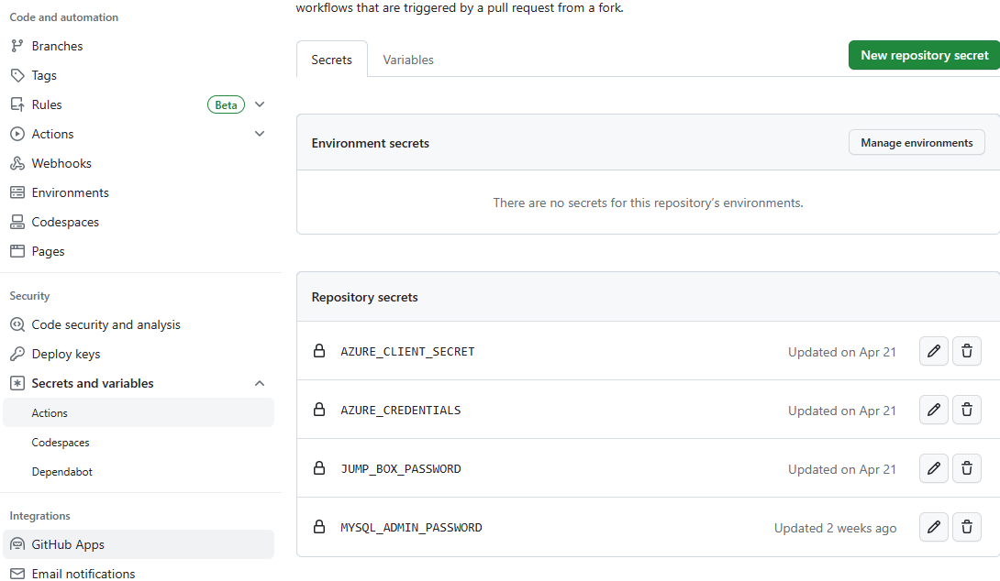
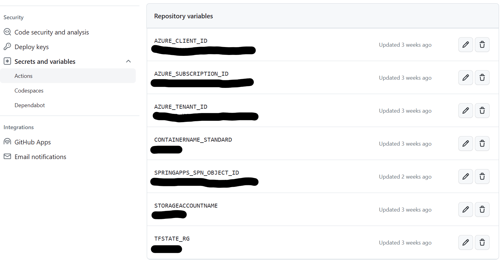
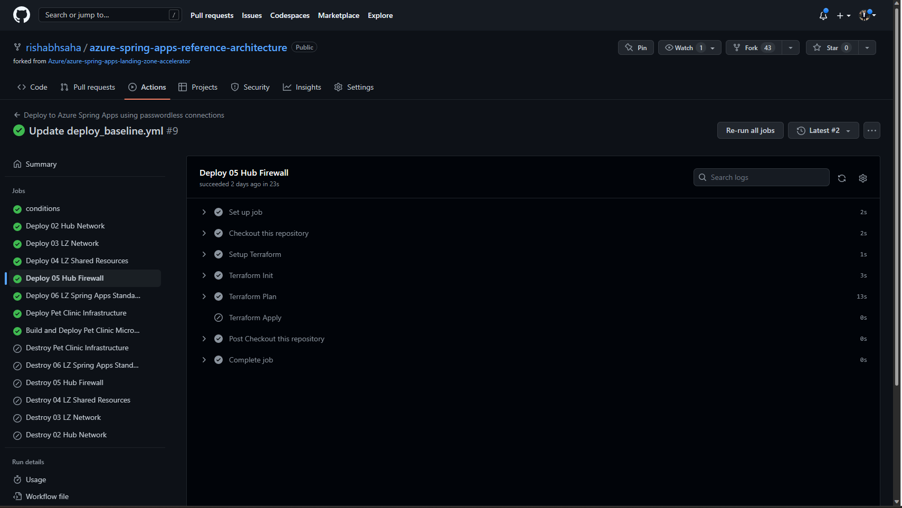

# Deploying the Landing Zones and Pet-Clinic microservices E2E using GitHub Actions

 To deploy the Azure Spring App Landing Zone and deploy the petclinic microservices to Azure Spring Apps, we'll setup a GitHub Actions CI/CD workflow that will build and deploy our application whenever we push new commits to the main branch of our repository.

## What's CI/CD?

CI/CD stands for _Continuous Integration_ and _Continuous Delivery_.

Continuous Integration is a software development practice that requires developers to integrate code into a shared repository several times a day.
Each integration can then be verified by an automated build and automated tests.
By doing so, you can detect errors quickly, and locate them more easily.

Continuous Delivery pushes this practice further, by preparing for a release to production after each successful build.
By doing so, you can get working software into the hands of users faster.

## What's GitHub Actions?

[GitHub Actions](https://github.com/features/actions) is a service that lets you automate your software development workflows.
It allows you to run workflows that can be triggered by any event on the GitHub platform, such as opening a pull request or pushing a commit to a repository.

It's a great way to automate your CI/CD pipelines, and it's free for public repositories.

## Setting Up GitHub Actions for deployment

To set up GitHub Actions for deployment, we'll need to use the new workflow file in our repository.
This file will contain the instructions for our CI/CD pipeline.

## Setup secrets and variables

Secrets in GitHub are encrypted and allow you to store sensitive information such as passwords or API keys, and use them in your workflows using the ${{ secrets.MY_SECRET }} syntax.

In GitHub, secrets and variables can be defined at three different levels:

* Repository level: secrets defined at the repository level are available in all workflows of the repository.

* Organization level: secrets defined at the organization level are available in all workflows of the GitHub organization.

* Environment level: secrets defined at the environment level are available only in workflows referencing the specified environment.

For this workshop, we’ll define our secrets and variables at the repository level. To do so, go to the Settings tab of your repository, and select Secrets and variables then Actions under it, in the left menu.

## [!TIP]

You can also use the [GitHub CLI](https://cli.github.com) to define your secrets, using the command `gh secret set <MY_SECRET> -b"<SECRET_VALUE>" -R <repository_url>`

## Create Secrets for this workflow

| Secret Name            | Value                                                                                                         |
| ---------------------- | ------------------------------------------------------------------------------------------------------------- |
| `JUMP_BOX_PASSWORD`    | Enter a strong password and store it securely for future use, possible in Azure Key Vault                     |
| `MYSQL_ADMIN_PASSWORD` | Enter a strong password and store it securely for future use, possible in Azure Key Vault                     |
| `AZURE_CREDENTIALS`    | Paste the value of the `AZURE_CREDENTIALS` variable as the secret value (make sure to _copy the entire JSon_) |
| `AZURE_CLIENT_SECRET`  | You can copy paste these values from the AZURE_CREDENTIALS value returned in the cli.                         |

The secrets tab should look like the following:


## Create required variables for this workflow

Switch to the Variables tab and create the following variables

| Variable Name              | Value                                                                                                               |
| -------------------------- | ------------------------------------------------------------------------------------------------------------------- |
| `AZURE_CLIENT_ID`          | Your tenant id can be found in Azure Active Directory                                                               |
| `AZURE_SUBSCRIPTION_ID`    | Your subscription id                                                                                                |
| `AZURE_TENANT_ID`          | Your Service Principal Client ID                                                                                    |
| `STORAGEACCOUNTNAME`       | Storage Account for storing terraform state                                                                         |
| `TFSTATE_RG`               | Resource group where Storage Account is located for storing terraform state                                         |
| `CONTAINERNAME_STANDARD`   | Container in the Storage Account for storing terraform state                                                        |
| `SPRINGAPPS_SPN_OBJECT_ID` | Object name for the Spring Apps built in service principle, see below for how to retreive the value for your tenate |


The variables tab should look similar to the following:


## Optional Variables 

Optionally you may set the following variables to control the behavoir of the workflow. 

| Variable Name              | Value                                                                              | Default Value |
| -------------------------- | ---------------------------------------------------------------------------------- | ------------- |
| `ENVIRONMENT_STANDARD`     | Environment (Dev,Stage,Prod) for this deployment. Will be added to resource names  | dev           |
| `NAME_PREFIX_STANDARD`     | Name Prefix (springlza) for this deployment. Will be used to create resource names | springlza     |
| `REGION_STANDARD`          | Azure Region to deploy resources (eastus)                                          | eastus        |
| `DEPLOY_FIREWALL_STANDARD` | Optionally deploy Azure firewall : true or false                                   | false         |
| `DESTROY_STANDARD`         | Optionally destroy the resources : true or false                                   | false         |


## Find the Object ID for Spring Apps Service Principal
* Retrieve the `SPRINGAPPS_SPN_OBJECT_ID` with the value of the the Object ID for the "Azure Spring Apps Resource Provider" service principal in your Azure AD Tenant.
  
You use the command below to obtain the value of the variable:

      az ad sp show --id e8de9221-a19c-4c81-b814-fd37c6caf9d2 --query id --output tsv


## Where to find the workflow `deploy_standrad.yml`
The workflow file can be found in your repository with the path [`.github/workflows/deploy_standard.yml`](../../../.github/workflows/deploy_standard.yml) :

This workflow will be triggered every time a commit is pushed to the `main` branch.
It will then run a job with the following steps:

* Deploy 02 Hub Network
* Deploy 03 LZ Network
* Deploy 04 LZ Shared Resources
* Deploy 05 Hub Firewall
* Deploy 06 LZ Spring Apps Standard
* Deploy Pet Clinic Infrastructure

After the above steps are successful, you will have a functioning landing zone and the Azure Spring App instance available. After the above, the workflow also runs the below build step to build and deploy the petclinic microservices in the Azure Spring Apps instance.

* Build and Deploy Pet Clinic Microservices

Make sure to keep the correct indentation for the steps if you make changes to the deploy.yaml file directly.
YAML is very sensitive to indentation.

## [!TIP]

* If you do not want to provision the firewall or destroy the E2E infra once the pipeline run in complete, make sure to set those values to false in the deploy_standard.yml or in GitHub actions variables.
* If a particular step errors out you can run only that step from the pipeline directly.Most errors should be transient errors.

## Running the workflow

Now that we've defined our workflow and prepared everything, we can run it to deploy our landing zone and the petclinic application to Azure Spring Apps.
Commit and push your changes to your repository, and go to the `Actions` tab of your repository to see the workflow running.
It should take a few minutes to complete.
A successful run using github actions should look like below:



## Testing the deployed application

Once your workflow is completed, let's make a quick test on our deployed apps.
First we need to get the ingress URL by running the following command:

```bash
    az spring app show -g rg-springlza-APPS -s spring-springlza-dev-o7o6 \
    --name api-gateway --query "properties.url" --output tsv    
```

Then we can use `curl` to test our applications using the above endpoint. This assumes that there's no Application Gateway and you would access your spring app using the spring apps ingress url for the api-gateway app instance. Since the applications are deployed in an internal only environment you would need to do the curl from a jumpbox or bastion host.
