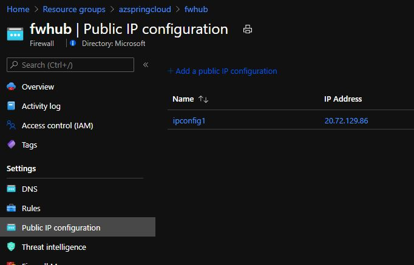

# Terraform Quickstart - Azure Spring Apps Reference Architecture

## Overview

## Prerequisites

**Note:** *You must have owner privileges on the target subscription. This script will automatically assign the Azure Spring Apps Resource Provider Owner rights on the created VNET.*

1. [Install Hashicorp Terraform](https://www.terraform.io/downloads.html)

    **Note:** This script was tested using the following terraform version:
    https://registry.terraform.io/providers/hashicorp/azurerm/3.21.1
    Earlier and later versions will need to be independently tested and verified.

2. [Install Azure CLI](https://docs.microsoft.com/cli/azure/install-azure-cli)

## Greenfield Deployment
 **Note:** A brownfield deployment option is also available, see [here](brownfield-deployment)

1. Login to Azure and select the target subscription.

    ```bash
    az login

    az account set --subscription "Your Subscription Name"
    ```

2. If you're deploying Azure Spring Apps Enterprise tier for the first time in the target subscription, use the following commands to register the provider and accept the legal terms and privacy statements for the Enterprise tier.

    ```
    az provider register --namespace Microsoft.SaaS
    
    az term accept \
    --publisher vmware-inc \
    --product azure-spring-cloud-vmware-tanzu-2 \
    --plan tanzu-asc-ent-mtr
    ``` 

3. Run the following command to initialize the terraform modules:

    ```bash
    cd greenfield-deployment
    terraform init
    ```

4. Run the following command to plan the terraform deployment:

    ```bash
    terraform plan -out=springapps.plan
    ```

    **Note:** Terraform will prompt you for the following variables:
      * Administrator username       [Used by Jumphost and Database services]
      * Administrator password       [Used by Jumphost and Database services]
      * Azure Spring Apps SKU        [Standard or Enterprise]
      * Location                     Deployment region (ex. East US) [for supported regions see](https://docs.microsoft.com/en-us/azure/spring-apps/faq?pivots=programming-language-java#in-which-regions-is-azure-spring-apps-basicstandard-tier-available)
        
5. Finally, deploy the terraform Spring Apps using the following command.

   ```bash
    terraform apply springapps.plan
   ```

## Post Deployment

There are a few options available from a post deployment perspective:

* For Enteprise deployments, use this [sample app](https://learn.microsoft.com/en-us/azure/spring-apps/quickstart-sample-app-acme-fitness-store-introduction)

* For Standard Deployments only, follow the instructions below

1. Install one of the following sample applications from the locations below:
    * [Pet Clinic App with MySQL Integration](https://github.com/azure-samples/spring-petclinic-microservices) (Microservices with MySQL backend)
    * [Simple Hello World](https://docs.microsoft.com/azure/spring-cloud/spring-cloud-quickstart?tabs=Azure-CLI&pivots=programming-language-java)

2. For an automated installation you can leverage a PowerShell or bash script provided on Jumpbox created during the deployment process. To install the Pet Clinic App leveraging the PowerShell or Shell Script that is provided as part of the deployment login in to the Jumphost (jumphostvm) created using the Bastion connection and the admin username and password created during the initial installation.  Both the PowerShell script and the Shell script can be found in c:\petclinic.

If you choose to leverage the PowerShell script you must navigate to the c:\petclinic and edit the deployPetClinicApp.ps1 script before running. Provide the following information for the corresponding variables:
    * Your Subscription ID
    * A Resource Group
    * An Azure Region
    * The name of the Spring Apps Service that was created
    * The name of the MySQL Server created
    * The MySQL Administrator name
    * The MySQL Administrator password

    The variables to be edited in the deployPetClinicApp.ps1 script are as follows:

    ```powershell
      $SUBSCRIPTION='<Insert your Subscription ID>'
      $RESOURCE_GROUP='<Insert Resource Group Name>'
      $REGION='<Insert Azure Region>'
      $SPRING_CLOUD_SERVICE='<Insert Spring Apps Service Name Created>'
      $MYSQL_SERVER_NAME='<Insert MySQL Server Name>'
      $MYSQL_SERVER_ADMIN_NAME='<Insert MySQL Admin Name>' 
      $MYSQL_SERVER_ADMIN_PASSWORD='<Insert MySQL Admin Password>'
    ```

    If you are more comfortable leveraging a shell script, navigate to the same directory, c:\petclininc, and edit the deployPetClinicApp.sh script before running. Provide the following information for the corresponding variables:

    ```bash
      subscription='<Insert your Subscription ID>'
      resource_group='<Insert Resource Group Name>'
      region='<Insert Azure Region>'
      spring_cloud_service='<Insert Spring Apps Service Name Created>'
      mysql_server_name='<Insert MySQL Server Name>'
      mysql_server_admin_name='<Insert MySQL Admin Name>' 
      mysql_server_admin_password='<Insert MySQL Admin Password>'
    ```

## Deploy Azure Application Gateway with WAF (optional)

Here you will have 2 options:

* **Option 1**: Use a public Azure Application gateway for direct ingress.
* **Option 2**: Use a private Azure Application gateway in between Azure Firewall and the Azure Spring Apps application (DNAT Rule and ingress on Azure Firewall).

**Note**: You will need a TLS/SSL Certificate with the Private Key (PFX Format) for the Application Gateway Listener. The PFX certificate on the listener needs the entire certificate chain and the password must be 4 to 12 characters. For the purpose of this quickstart, you can use a self signed certificate or one issued from an internal Certificate Authority.

### Option 1 - Public Application Gateway

1. Change the directory to to deployPublicAppGW

   ```bash
   cd deployPublicAppGW
   ```

2. Copy the SSL/TLS certificate PFX file to this directory.

3. Run the following command to initialize the terraform.

    ```bash
    terraform init
    ```

4. Run the following command to plan the terraform deployment.

    ```bash
    terraform plan -out=appgwpublic.plan
    ```

    When prompted enter the values for the following variables:
    * az_fw_name - The name of the Azure Firewall Resource
    * az_fw_pip - The Public IP of the Azure Firewall used for DNAT
    * backendPoolFQDN - FQDN of the backend URL of the Azure Spring Apps Application e.g. petclinic-in-vnet-api-gateway.private.azuremicroservices.io
    * certfilename - The filename of the PFX certificate file which will be added to the Application Gateway Listener
    * https_password - The password for the PFX file which will be used for the App Gateway Listener

5. Once deployed, look for the Application Gateway Resource in the Resource Group and note the Frontend Public IP address.

6. From a browser that isn't in the quickstart virtual network, browse to https://`<publicIPofAppGW>`. You will get a warning in the browser that the connection is not secure. This is expected as we are connecting via the IP address. Proceed to the page anyway.


### Option 2 - Private Application Gateway behind Azure Firewall (DNAT)

1. Change the directory to to deployPrivateAppGW

    ```bash
    cd deployPrivateAppGW
    ```

2. Copy the SSL/TLS certificate PFX file to this directory.

3. Run the following command to initialize the terraform:

    ```bash
    terraform init
    ```

4. Run the following command to plan the terraform deployment:

    ```bash
    terraform plan -out=appgwprivate.plan
    ```

    When prompted enter the values for the following variables:
    * backendPoolFQDN - FQDN of the backend URL of the Azure Spring Apps Application e.g. petclinic-in-vnet-api-gateway.private.azuremicroservices.io
    * certfilename - The filename of the PFX certificate file which will be added to the Application Gateway Listener
    * https_password - The password for the PFX file which will be used for the App Gateway Listener

5. Locate the Public IP of your Azure Firewall.

    

6. From a browser that isn't in the quickstart virtual network, browse to https://`<publicIPofAzFWNatRule>`. You will get a warning in the browser that the connection is not secure. This is expected as we are connecting via the IP address being used for the DNAT rule. Proceed to the page anyway.

    

## Cleaning up

Unless you plan to perform additional tasks with the Azure resources from the quickstart (such as post deployment steps above), it is important to destroy the resources that you created to avoid the cost of keeping them provisioned.

The easiest way to do this is to call `terraform destroy`. Do this in both directories (root directory and relevant app gateway directory).

  ```bash
  terraform destroy
  ```

## Change Log
* **11-06-22** - Added Enterprise SKU with Tanzu components, Azure Database for PostgreSQL and Azure Cache for Redis
* **03-05-21** - Added bring your own route table as documented in the [Azure Spring Apps documentation](https://docs.microsoft.com/azure/spring-cloud/spring-cloud-tutorial-deploy-in-azure-virtual-network#bring-your-own-route-table)
* **03-16-21** - Added third option to install PetClinic Application using PowerShell or Shell Script provided on the jumpbox

## Additional Notes

You can use a custom domain suffix for your Azure Spring Apps application instead of the default .private.azuremicrososervices.io domain suffix. See the [custom-domain](https://github.com/Azure/azure-spring-cloud-reference-architecture/blob/main/custom-domain/) section of this repo.
